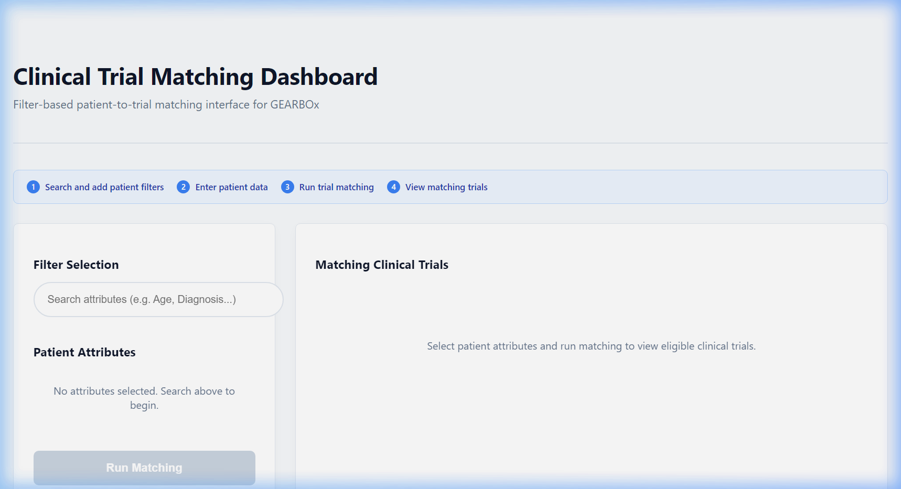
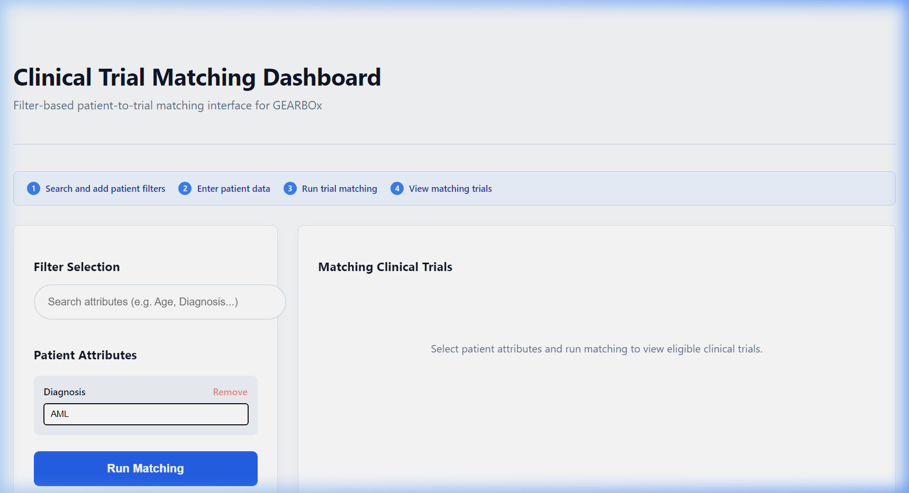
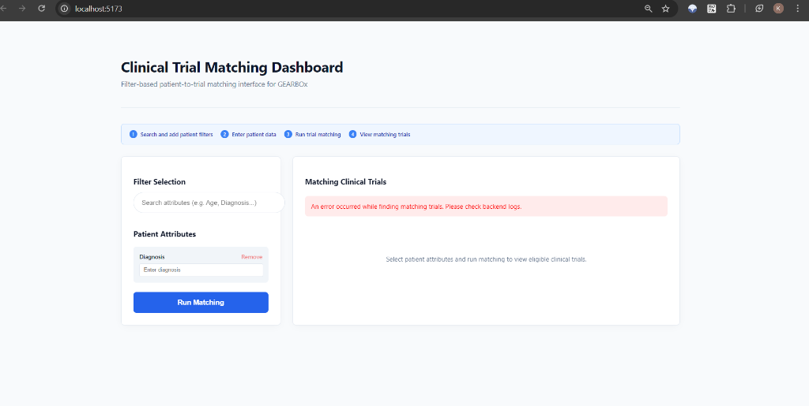
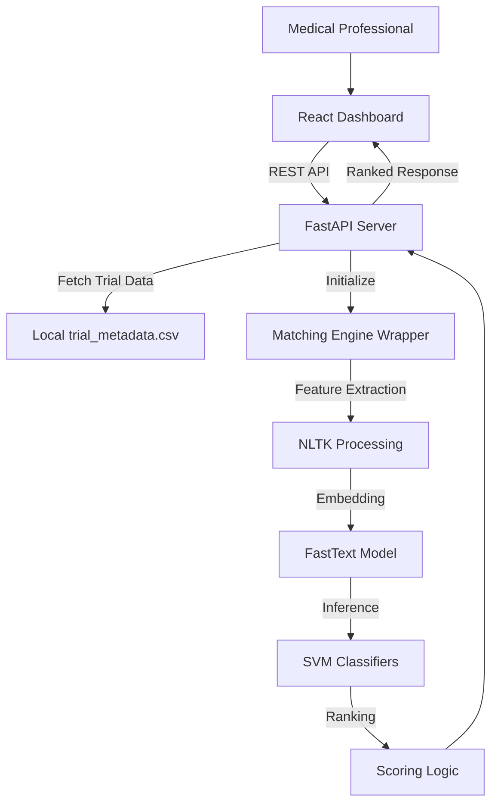

# GEARBOx: Automated Clinical Trial Matching Dashboard

GEARBOx is an open-source clinical matching system designed to automate the screening of patients for clinical trials using Natural Language Processing (NLP) and Support Vector Machines (SVM). This implementation modernizes the GEARBOx platform by transitioning from legacy long-form questionnaires to a high-performance, filter-driven React dashboard.

## 📋 Project Overview

The core objective of this project is to improve the usability of clinical trial matching for medical professionals. Most matching systems require exhaustive data entry for every patient. This project allows researchers to perform high-precision matching using only the attributes available at the point of care (e.g., specific diagnoses, lab values, or age), significantly reducing cognitive load and data entry time.

### ✨ Key Features
*   **Dynamic Attribute Selection**: Search and selectively add patient parameters using a typeahead interface.
*   **NLP-Driven Matching**: Leverages FastText embeddings and specialized SVM models for semantic understanding of trial eligibility.
*   **Real-time Results**: Rankings are computed and displayed instantly via a FastAPI backend.
*   **Maintainer-Ready Stack**: Built with React (TypeScript/Vite) and FastAPI for high scalability and portability.

## 🖼️ Interface & Workflow

### 1. Dynamic Patient Attribute Filters
The system allows users to select only relevant patient attributes, making it practical for real-world clinical research where data may be incomplete.

### 2. Matching Results
Clinical trials are ranked based on a composite match score derived from 17 medical-domain classifiers (Renal, Hepatic, Prior Therapy, etc.).

## 🏗️ System Architecture

The project follows a decoupled, three-tier architecture:

## 🚀 Setup and Installation

### Backend Setup
1.  Ensure Python 3.9+ is installed.
2.  Install dependencies: `pip install -r backend/requirements.txt`
3.  Pre-trained models reside in the `trained_ML_models/` directory.

### Frontend Setup
1.  Ensure Node.js and npm are installed.
2.  Navigate to `/frontend` and run `npm install`.

### Local Execution (Quick Start)
For convenience, use the included operational scripts:
- **Windows**: Run `run_backend.bat` and `run_frontend.bat`.
- **Linux/macOS**: Run `./run_backend.sh` and `./run_frontend.sh`.

Dashboard will be available at `http://localhost:5173`.

## 🛠️ API Reference

### GET `/filters`
Returns a structured list of patient attributes used for the matching engine.

### POST `/match`
Accepts patient attribute JSON and returns a ranked list of clinical trials with match scores.

## 📝 Methodology Note
This implementation uses a validated ensemble of SVM classifiers trained on FastText embeddings. Text preprocessing includes regex cleaning, lemmatization, and POS-tagging to ensure high semantic accuracy before criteria classification.
