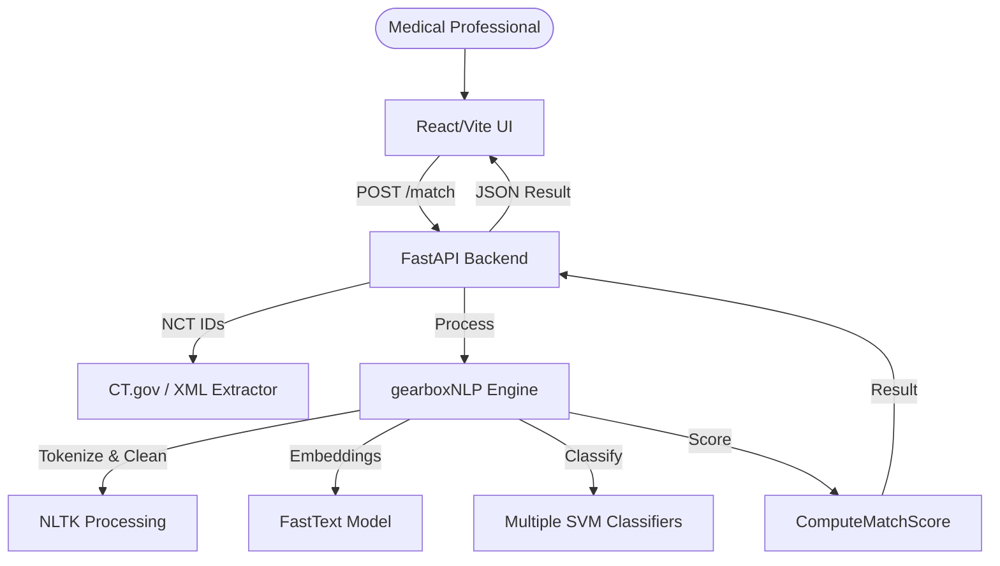

# GEARBOx Clinical Trial Matching System

GEARBOx is an automated matching system that uses Natural Language Processing (NLP) and Machine Learning (ML) to match patients to oncology clinical trials based on complex eligibility criteria.

## System Architecture



## Features

- **Dynamic Filter Search**: Users can search for specific patient characteristics only when they have data for them.
- **Automated Score Calculation**: Matches are ranked based on a percentage score derived from eligibility criteria classification.
- **Protocol Summaries**: Quick link to trial protocols and short criteria summaries.
- **Minimal, Production-Ready UI**: Designed for efficiency in clinical settings.

## Backend Setup

1. **Python Environment**: Ensure Python 3.9+ is installed.
2. **Installation**:
   ```bash
   pip install -r backend/requirements.txt
   ```
3. **ML Models**: Ensure `trained_ML_models/` folder contains SVM and FastText models (see current structure).
4. **Run Server**:
   ```bash
   python backend/main.py
   ```
   Or use the run scripts: `run_backend.sh` or `run_backend.bat`.

## Frontend Setup

1. **Node.js**: Ensure Node.js is installed.
2. **Installation**:
   ```bash
   cd frontend
   npm install
   ```
3. **Run Dev Server**:
   ```bash
   npm run dev
   ```
   Or use the run scripts: `run_frontend.sh` or `run_frontend.bat`.

## API Endpoints

### GET /filters
Returns available filter fields for patient data.

**Example Response:**
```json
[
  {"id": "Age (Days)", "label": "Age (Days)", "type": "number"},
  {"id": "Diagnosis", "label": "Diagnosis", "type": "text"},
  {"id": "Female", "label": "Female", "type": "boolean"},
  ...
]
```

### POST /match
Accepts patient filters and returns ranked trial results.

**Request Body Body:**
```json
{
  "filters": {
    "Age (Days)": 5000,
    "Diagnosis": "Relapsed ALL",
    "Performance Status (Lanksy/Karnofsky)": 80
  }
}
```

**Response Body:**
```json
{
  "results": [
    {
      "trial_id": "NCT00002547",
      "trial_name": "NCT00002547",
      "match_score": 0.85,
      "criteria_summary": "DISEASE CHARACTERISTICS: The following hematologic malignancies are eligible...",
      "trial_link": "https://clinicaltrials.gov/ct2/show/NCT00002547"
    },
    ...
  ]
}
```

## Testing Steps

1. Start the backend: `run_backend.bat`.
2. Start the frontend: `run_frontend.bat`.
3. Open `http://localhost:5173` in your browser.
4. Search for "Age" and "Diagnosis" in the search bar.
5. Enter values (e.g., Age: 5000, Diagnosis: ALL).
6. Click "Find Matching Trials".
7. Verify results appear in the table with match scores.

## Project Structure

```
project-root/
│
├── backend/
│   ├── main.py (FastAPI Server)
│   ├── matching_engine_wrapper.py (ML Logic)
│   ├── requirements.txt
│
├── frontend/ (Vite React App)
│   ├── src/
│   │   ├── pages/TrialMatchingPage.tsx
│   │   └── index.css
│
├── trained_ML_models/ (Pre-trained classifiers & embeddings)
├── project_data/ (CSV datasets & sample data)
├── jupyter_notebooks/ (Original research notebooks)
├── run_backend.sh/bat
├── run_frontend.sh/bat
└── README.md
```
