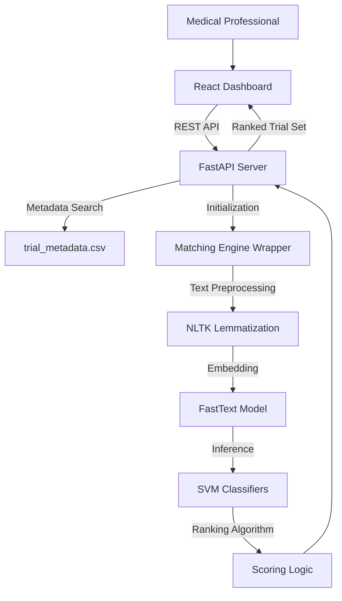

# GEARBOx: Automated Clinical Trial Matching Dashboard

GEARBOx is an open-source clinical matching system designed to automate the screening of patients for clinical trials using Natural Language Processing (NLP) and Support Vector Machines (SVM). This implementation modernizes the GEARBOx platform by transitioning from legacy long-form questionnaires to a high-performance, filter-driven React dashboard.

## Project Overview

The core objective of this project is to improve the clinical trial matching workflow for medical professionals. Most matching systems require exhaustive data entry for every patient regardless of data availability. This project allows researchers to perform high-precision matching using only the patient attributes available at the point of care (e.g., specific diagnoses, lab values, or age), which significantly reduces data entry time and improves matching agility.

### Technical Features
*   Dynamic Attribute Selection: Search and selectively add patient parameters using a typeahead interface.
*   NLP-Driven Matching Engine: Leverages FastText embeddings and specialized SVM models for semantic understanding of trial eligibility requirements.
*   Real-time Ranking: Match scores are computed and returned instantly via a dedicated FastAPI backend.
*   Portability and Scalability: Built with React (TypeScript/Vite) and FastAPI for high-performance deployment across clinical environments.

## Interface and Workflow

### Dynamic Patient Attribute Filters
The system allows researchers to select only the clinically relevant attributes they have available, making it practical for real-world research scenarios where patient data may be incomplete.

### Automated Matching Results
Clinical trials are sorted based on a composite match score derived from an ensemble of 17 medical-domain classifiers (Renal, Hepatic, Prior Therapy, etc.).

## System Architecture

The project utilizes a decoupled, three-tier architecture developed for reliability and performance:

## Setup and Installation

### Backend Environment Setup
1.  Python 3.9 or higher is required.
2.  Install all dependencies: `pip install -r backend/requirements.txt`
3.  Ensure pre-trained models are correctly located in the `trained_ML_models/` directory.

### Frontend Environment Setup
1.  Node.js and npm are required.
2.  Navigate to the `/frontend` directory and run `npm install`.

### Quick Start Instructions
For standard local execution, use the provided operational scripts:
- Windows: Run `run_backend.bat` and `run_frontend.bat`.
- Linux/macOS: Run `./run_backend.sh` and `./run_frontend.sh`.

The dashboard will be available at: `http://localhost:5173`.

## API reference

### GET /filters
Provides a structured JSON list of all patient attributes recognized by the matching engine.

### POST /match
Submits a patient attribute payload and returns a ranked list of clinical trials with corresponding match scores.

## Technical Methodology
The matching engine uses a validated ensemble of SVM classifiers trained on FastText embeddings (256-dimensional vectors). Preprocessing includes comprehensive regex cleaning, NLTK-based lemmatization, and POS-tagging to ensure semantic accuracy before vectorization and classification.
