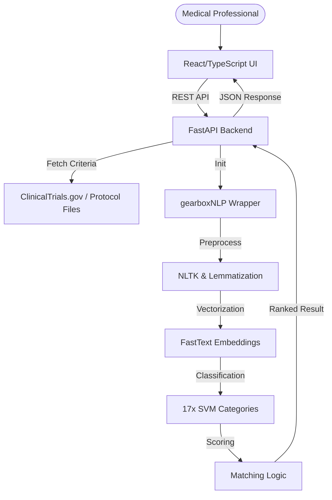

# GEARBOx: Automated Matching of Patients to Clinical Trials

GEARBOx is an open-source clinical trial matching engine that utilizes Natural Language Processing (NLP) and Support Vector Machines (SVM) to automate the enrollment process. By parsing trial eligibility criteria and mapping them to patient characteristics, it provides a ranked list of matched trials for hematologic malignancies.

## Project Overview

The current user interface replaces the traditional long-form questionnaire with a modern, dynamic, and filter-based search experience. Medical professionals can now input specific patient data using a typeahead interface, selecting only the filters they have data for, which drastically reduces input overhead and improves matching efficiency.

### Key Features
- **Dynamic Filter Selection**: Select patient filters (Age, Diagnosis, Performance Status, etc.) only when data is available.
- **NLP Matching Engine**: Uses FastText embeddings and specialized SVM classifiers to categorize trial criteria.
- **Automated Score Calculation**: Matches are scored and ranked according to the relevance and potential eligibility.
- **Rich Dashboard UI**: A premium, responsive interface built with React and TypeScript.

---

## 🏗️ System Architecture



---

## 🚀 Getting Started

### Prerequisites
- Python 3.9 or higher
- Node.js (v18+) and npm
- `nltk` data resources

### Backend Installation
1.  Navigate into the `backend/` directory.
2.  Install required dependencies:
    ```bash
    pip install -r backend/requirements.txt
    ```
3.  The ML models should be located in `trained_ML_models/` as categorized by FastText and SVM directories.

### Frontend Installation
1.  Navigate into the `frontend/` directory.
2.  Install npm packages:
    ```bash
    npm install
    ```

---

## 🛠️ Usage

For convenience, ready-to-use launch scripts are provided for both Windows and Linux/Bash.

- **To run the Backend**: Run `run_backend.sh` or `run_backend.bat`.
- **To run the Frontend**: Run `run_frontend.sh` or `run_frontend.bat`.

Once both services are running, the application will be accessible at: `http://localhost:5173`.

### Backend API Endpoints

| Endpoint | Method | Description |
| :------- | :----- | :---------- |
| `/filters` | `GET` | Fetches all available patient data filters used for matching. |
| `/match` | `POST` | Processes patient characteristics and returns a ranked list of trial matches. |

---

## 📈 Methodology

The matching engine follows a robust four-step process:
1.  **Trial Info Fetching**: Direct XML retrieval from `clinicaltrials.gov`.
2.  **Criteria Extraction**: Segmenting text blocks into individual eligibility points.
3.  **Classification**: Using SVMs to identify critical categories (e.g., Renal Function, Hepatic Function, CNS Involvement).
4.  **Mathematical Scoring**: Calculating a composite score of matches vs. potentials, weighted by criteria relevance.

---

## 🤝 Contributions

We welcome contributions from the community! Please ensure that any PRs follow the existing architecture and includes tests for any new matching logic categories.

---

## 📄 License

This project is licensed under the MIT License - see the LICENSE file for details (if available).

## Project Maintainer Note
This modern UI is an enhancement designed for efficiency in clinical settings, maintaining full stability with the original GEARBOx NLP research models.
