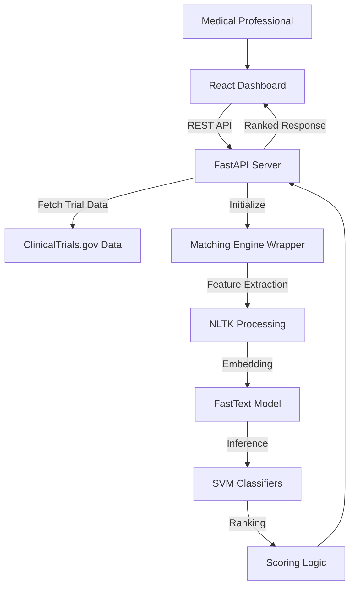

# GEARBOx: Automated Clinical Trial Matching Engine

GEARBOx is an open-source matching engine designed to automate the screening of patients for clinical trials using Natural Language Processing (NLP) and Support Vector Machines (SVM). It enables efficient enrollment by parsing trial eligibility and mapping them to specific patient characteristics.

## Project Overview

The current implementation provides a modern, filter-driven dashboard that eliminates the need for manual, long-form screening questionnaires. By utilizing a typeahead search interface, medical professionals can input only the specific patient attributes they have data for, significantly improving matching precision and reducing cognitive load.

### Key Technical Features
*   **Dynamic Data Attributes**: Search and selectively add patient parameters (Age, Performance Status, Clinical Diagnosis, etc.).
*   **Vectorization & Embedding**: Utilizes FastText embeddings for semantic understanding of eligibility criteria.
*   **Multi-Class Classification**: Employs 17 specialized SVM models to categorize criteria across key medical domains (e.g., Renal, Hepatic, Prior Therapy).
*   **Ranking Algorithm**: Computes a composite match score to rank clinical trials based on patient-to-criteria compatibility.
*   **Decoupled Architecture**: High-performance FastAPI backend interface and a responsive React/TypeScript frontend implementation.

## System Architecture

## Setup and Installation

### Backend Requirements
*   Python 3.9 or higher
*   Required packages: `fastapi`, `uvicorn`, `pandas`, `nltk`, `gensim`, `scikit-learn`, `joblib`
*   Pre-trained models must be available in the `trained_ML_models/` directory.

### Frontend Requirements
*   Node.js and npm
*   Built with React, TypeScript, and Vite.

### Local Execution Instructions

For simplified local development, use the following operational scripts:

- **Windows**:
  - Run `run_backend.bat` for the API server.
  - Run `run_frontend.bat` for the React dashboard.
- **Linux/macOS**:
  - Run `run_backend.sh` for the API server.
  - Run `run_frontend.sh` for the React dashboard.

Access the dashboard at `http://localhost:5173`.

## API Documentation

| Endpoint | Method | Input | Description |
| :------- | :----- | :---- | :---------- |
| `/filters` | GET | N/A | Returns list of patient attributes used for matching. |
| `/match` | POST | JSON | Submits patient data and returns ranked clinical trials. |

## Methodology Note
The matching logic is derived from validated research models. Criteria segmentation and classification have been optimized for high performance, utilizing lemmatization and POS-tagging to ensure semantic accuracy before vectorization.
