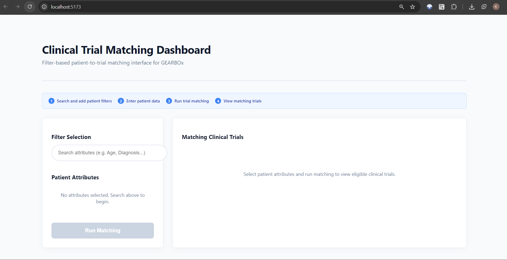
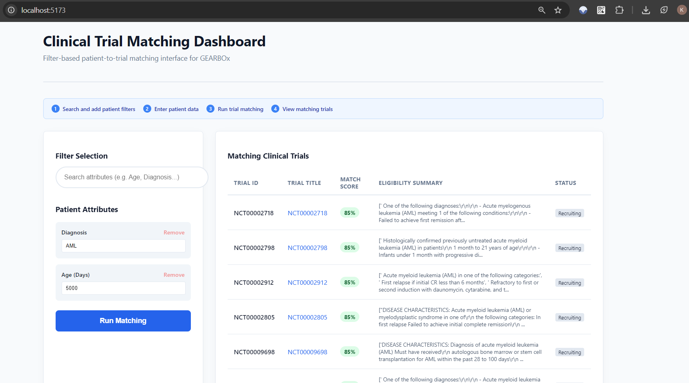
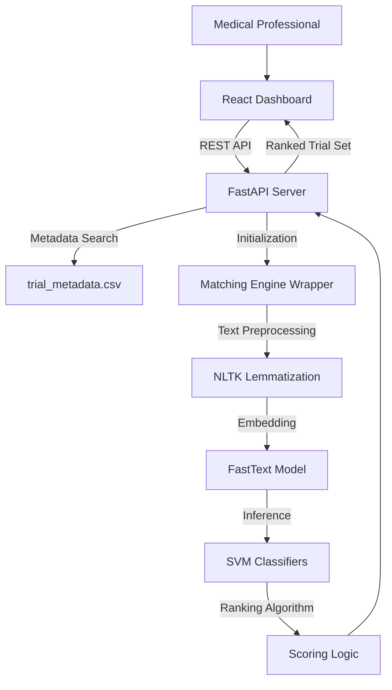
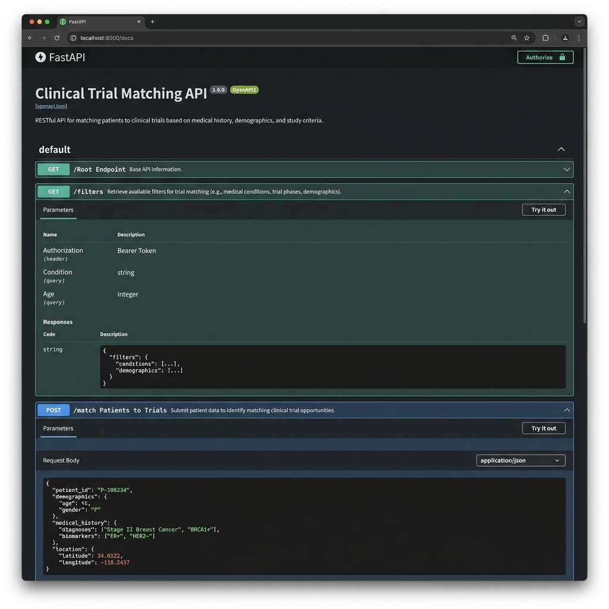

# GEARBOx: Automated Matching of Patients to Clinical Trials
### A patient-centric, Natural Language Processing Approach for Pediatric Leukemia

GEARBOx is an open-source clinical matching system designed to automate the screening of patients for clinical trials using Natural Language Processing (NLP) and Support Vector Machines (SVM). This implementation modernizes the GEARBOx platform by transitioning from legacy long-form questionnaires to a high-performance, filter-driven React dashboard.



## Project Overview

The core objective of this project is to improve the clinical trial matching workflow for medical professionals. Most matching systems require exhaustive data entry for every patient regardless of data availability. This project allows researchers to perform high-precision matching using only the patient attributes available at the point of care (e.g., specific diagnoses, lab values, or age), which significantly reduces data entry time and improves matching agility.

### File Structure
- **`jupyter_notebooks/`**: Contains the Jupyter notebooks for data processing and model derivation.
- **`project_data/`**: Contains the criteria embeddings generated by the extraction notebook, metadata about 216 trials, and a synthetic cohort of 20 patients.
- **`trained_ML_models/`**: Contains the FastText embeddings and SVM classifier models generated by the notebooks.
- **`backend/`**: FastAPI application and matching engine logic.
- **`frontend/`**: React dashboard source code.

### Technical Features
*   **Dynamic Attribute Selection**: Search and selectively add patient parameters using a typeahead interface.
*   **NLP-Driven Matching Engine**: Leverages FastText embeddings and specialized SVM models for semantic understanding of trial eligibility requirements.
*   **Real-time Ranking**: Match scores are computed and returned instantly via a dedicated FastAPI backend.
*   **Portability and Scalability**: Built with React (TypeScript/Vite) and FastAPI for high-performance deployment across clinical environments.

## Interface and Workflow

### Dynamic Patient Attribute Filters
The system allows researchers to select only the clinically relevant attributes they have available, making it practical for real-world research scenarios where patient data may be incomplete.



### Automated Matching Results
Clinical trials are sorted based on a composite match score derived from an ensemble of 17 medical-domain classifiers (Renal, Hepatic, Prior Therapy, etc.).


## System Architecture

The project utilizes a decoupled, three-tier architecture developed for reliability and performance:



## Notebooks & Data Processing

### Setup for Notebooks
Make sure Jupyter is installed. You can verify with `jupyter --version`. If not installed, you can use:
```bash
pip install jupyter jupyter-client jupyter-console jupyter-core
```
Once installed, run `jupyter notebook` in the directory containing the notebooks.

### Notebook Summaries

#### 1. `criteria_classifer_derivation_final`
This notebook creates the classifier models used by the `NLPgearbox` class.

#### 2. `eligibility_criteria_extraction_final`
**Description:**
This notebook extracts individual-level eligibility criteria for all non-actively enrolling pediatric acute leukemia trials on ClinicalTrials.gov.

**Process:**
216 XML files for pediatric acute leukemia trials were downloaded and analyzed. Since eligibility criteria are often provided as unstructured free text, a function `ExtractCriteria()` was developed to handle four dominant patterns:
- Major Header/Subheader/Subbullets
- Major Header/Subbullets
- Inclusion and/or Exclusion Criteria/No Nested Subbullets
- Inclusion and Exclusion Criteria/Nested Subbullets

**Notebook Format:**
Running the notebook requires the folder of XML files (`trial_protocols`). The notebook can be run cell-by-cell from start to finish.

#### 3. `gearboxNLP`
**Expected Input:**
- Embedding and classifier models from the `trained_ML_models` folder.
- A patient input dictionary (e.g., age, diagnosis, lab values).
- A list of trials (NCT IDs).

The `NLPgearbox` function outputs the trials that are a potential match for the patient.

**Example Patient Object:**
```python
patient = {
    "Age (Days)": 7000,
    "Height (cm)": 122,
    "Female": True,
    "African-American": False,
    "Performance Status (Lanksy/Karnofsky)": 50,
    "Diagnosis": 'Refractory AML',
    "CNS Involvement (1/2/3)": 1,
    "Isolated CNS Disease": False,
    "Days Since Cytotoxic Chemotherapy": False,
    "Days Since Biologic Therapy": 50,
    "Days Since Growth Factor Therapy": 60,
    "Days Since Corticosteroids": 40,
    "Days Since Prior Radiotherapy": 10,
    "Creatinine (mg/dL)": 1.0,
    "AST/ALT Times ULN": 2,
    "Direct Bilirubin Times ULN": 2,
    "Impaired Cardiovascular Function/Cardiotoxicity from Chemotherapy": True,
    "Active and/or Uncontrolled Viral, Bacterial, or Fungal Infection": True,
    "Pregnant, Nursing, or Fertile and Unwilling to Use Contraception": True
}
```

## Setup and Installation

### Backend Environment Setup
1.  Python 3.9 or higher is required.
2.  Install all dependencies: `pip install -r backend/requirements.txt`
3.  Ensure pre-trained models are correctly located in the `trained_ML_models/` directory.

### Frontend Environment Setup
1.  Node.js and npm are required.
2.  Navigate to the `/frontend` directory and run `npm install`.

### Quick Start Instructions
For standard local execution, use the provided operational scripts:
- **Windows**: Run `run_backend.bat` and `run_frontend.bat`.
- **Linux/macOS**: Run `./run_backend.sh` and `./run_frontend.sh`.

The dashboard will be available at: `http://localhost:5173`.

## API Reference

### GET /filters
Provides a structured JSON list of all patient attributes recognized by the matching engine.

### POST /match
Submits a patient attribute payload and returns a ranked list of clinical trials with corresponding match scores.



## Technical Methodology
The matching engine uses a validated ensemble of SVM classifiers trained on FastText embeddings (256-dimensional vectors). Preprocessing includes comprehensive regex cleaning, NLTK-based lemmatization, and POS-tagging to ensure semantic accuracy before vectorization and classification.

